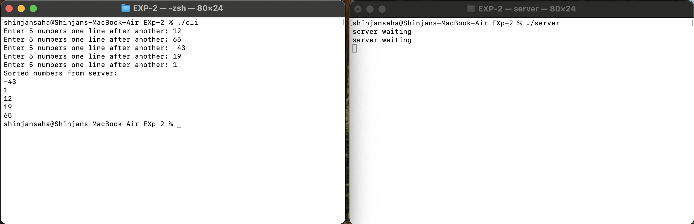

# EXP-2

## Objective:-

### Write C Programs to implement a simple client-server application. A client will send N integers to the server, which will sort the integers and send them back to the client. The client will print the result. Use Unix File socket for communication.

## Client Code:-

```bash
#include <sys/types.h>
#include <sys/socket.h>
#include <stdio.h>
#include <sys/un.h>
#include <unistd.h>
#include <stdlib.h>
#include <string.h>

int main() 
{ 
    int sockfd; 
    int len; 
    struct sockaddr_un address; 
    int result; 
    int stream[5], i; 

    sockfd = socket(AF_UNIX, SOCK_STREAM, 0);  
    address.sun_family = AF_UNIX; 
    strcpy(address.sun_path, "server_socket"); 

    len = sizeof(address); 
    result = connect(sockfd, (struct sockaddr *)&address, len); 

    if(result == -1) 
    { 
        perror("oops: client1"); 
        exit(1); 
    } 

    for(i = 0; i < 5; i++) 
    { 
        printf("Enter 5 numbers one line after another: "); 
        scanf("%d", &stream[i]); 
    } 

    for(i = 0; i < 5; i++) 
    { 
        write(sockfd, &stream[i], sizeof(int)); 
    } 

    for(i = 0; i < 5; i++) 
    { 
        read(sockfd, &stream[i], sizeof(int)); 
    } 

    printf("Sorted numbers from server:\n");
    for(i = 0; i < 5; i++) 
    { 
        printf("%d\n", stream[i]); 
    } 

    close(sockfd); 
    exit(0); 
}
```

## Steps to Run Code:-

```bash
gcc client.c -o clinet
```

```bash
./clinet
```


## Server Code:-

```bash
#include <sys/types.h>
#include <sys/socket.h>
#include <stdio.h>
#include <sys/un.h>
#include <unistd.h>
#include <stdlib.h>
#include <string.h>  

int main() 
{ 
    int server_sockfd, client_sockfd; 
    socklen_t client_len;  
    struct sockaddr_un server_address; 
    struct sockaddr_un client_address; 

    unlink("server_socket"); 

    server_sockfd = socket(AF_UNIX, SOCK_STREAM, 0); 
    server_address.sun_family = AF_UNIX; 
    strcpy(server_address.sun_path, "server_socket");  

    int server_len = sizeof(server_address); 
    bind(server_sockfd, (struct sockaddr *)&server_address, server_len); 
    listen(server_sockfd, 5); 

    while (1) 
    { 
        int stream[5]; 
        printf("server waiting\n"); 
        int i, j; 

        client_len = sizeof(client_address); 
        client_sockfd = accept(server_sockfd, (struct sockaddr *)&client_address, &client_len);  // <-- Fixed type

        for(i = 0; i < 5; i++) 
        { 
            read(client_sockfd, &stream[i], sizeof(int)); 
        } 

        for(i = 0; i < 5; i++) 
        { 
            for(j = i + 1; j < 5; j++) 
            { 
                if(stream[i] > stream[j]) 
                { 
                    int a = stream[i]; 
                    stream[i] = stream[j]; 
                    stream[j] = a; 
                } 
            } 
        } 

        for(i = 0; i < 5; i++) 
        { 
            write(client_sockfd, &stream[i], sizeof(int)); 
        } 

        close(client_sockfd); 
    } 
}
```

## Steps to Run Code:-

```bash
gcc server.c -o server
```

```bash
./server
```

## Working:-
