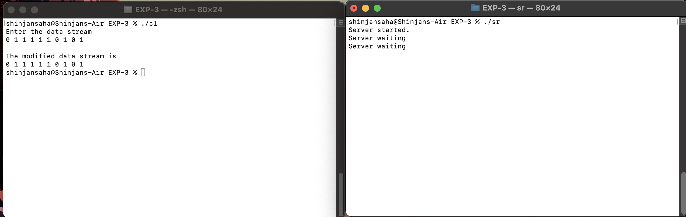

# EXP-3

## Objective:-

### TCP Programming

### Client Code:-

```bash
#include <sys/socket.h>
#include <stdio.h>
#include <netinet/in.h>
#include <arpa/inet.h>
#include <unistd.h>
#include <stdlib.h>
#include <string.h>

int main()
{
    int sockfd;
    int len;
    struct sockaddr_in address;
    int result;
    int i, stream[100];

   
    printf("Enter the data stream\n");
    for(i = 0; i < 10; i++)
    {
        scanf("%d", &stream[i]);
    }

    sockfd = socket(AF_INET, SOCK_STREAM, 0);
    address.sin_family = AF_INET;
    address.sin_addr.s_addr = inet_addr("127.0.0.1");
    address.sin_port = 9734;
    len = sizeof(address);
    result = connect(sockfd, (struct sockaddr *)&address, len);
    if(result == -1)
    {
        perror("oops : client");
        exit(1);
    }

    for(i = 0; i < 10; i++)
    {
        write(sockfd, &stream[i], sizeof(int));
    }

   
    for(i = 0; i < 10; i++)
    {
        read(sockfd, &stream[i], sizeof(int));
    }

    printf("\nThe modified data stream is\n");
    for(i = 0; i < 10; i++)  
    {
        printf("%d ", stream[i]);
    }

    exit(0);
}
```

### Server Code:-

```bash
#include <sys/types.h>
#include <sys/socket.h>
#include <stdio.h>
#include <netinet/in.h>
#include <arpa/inet.h>
#include <unistd.h>
#include <stdlib.h>
#include <string.h>

int main()
{
    int client_sockfd, server_sockfd;
    socklen_t client_len;  
    int server_len;
    int stream[100];
    int i, j, k, count = 0, length = 0;

    struct sockaddr_in server_address;
    struct sockaddr_in client_address;

    server_sockfd = socket(AF_INET, SOCK_STREAM, 0);
    server_address.sin_family = AF_INET;
    server_address.sin_addr.s_addr = inet_addr("127.0.0.1");
    server_address.sin_port = 9734;
    server_len = sizeof(server_address);

    bind(server_sockfd, (struct sockaddr *)&server_address, server_len);
    listen(server_sockfd, 5);
    printf("Server started.\n");

    while(1)
    {
        printf("Server waiting\n");
        client_len = sizeof(client_address);  
        client_sockfd = accept(server_sockfd, (struct sockaddr *)&client_address, &client_len);  

        
        for(i = 0; i < 10; i++)
        {
            read(client_sockfd, &stream[i], sizeof(int));
        }

        
        for(i = 0; i < 10; i++)
        {
            if(stream[i] == 0 && stream[i+1] == 1 && stream[i+2] == 1 && stream[i+3] == 1 &&
               stream[i+4] == 1 && stream[i+5] == 1)
            {
                for(j = 5 + count; j > i; j--)
                {
                    stream[j+1] = stream[j];
                }
                stream[i+6] = 0;
                count++;
            }
        }

        
        for(i = 0; i < 10 + count; i++)
        {
            write(client_sockfd, &stream[i], sizeof(int));
        }
    }
}
```


# Output

