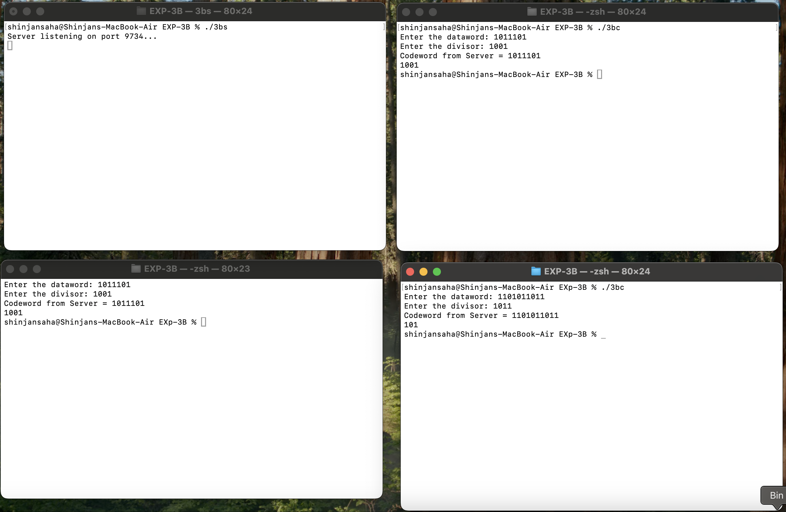

# EXP-3B

## Objective:- TCP socket programming(Multi client using threading) – CRC


### Client Code:-

```bash
#include<stdio.h>
#include<string.h>
#include<stdlib.h>
#include<unistd.h>
#include<sys/types.h>
#include<sys/socket.h>
#include<netinet/in.h>
#include<arpa/inet.h>

#define MAXSIZE 15

int main()
{
    char val[MAXSIZE];
    int sockfd, result, len;
    struct sockaddr_in address;

    sockfd = socket(AF_INET, SOCK_STREAM, 0);
    address.sin_family = AF_INET;
    address.sin_addr.s_addr = inet_addr("127.0.0.1");
    address.sin_port = htons(9734); // htons important!

    len = sizeof(address);
    sleep(1); // allow server to be ready

    result = connect(sockfd, (struct sockaddr *)&address, len);
    if (result == -1)
    {
        perror("Client Error!");
        exit(1);
    }

    printf("Enter the dataword: ");
    fgets(val, MAXSIZE, stdin);
    write(sockfd, val, sizeof(val));

    printf("Enter the divisor: ");
    fgets(val, MAXSIZE, stdin);
    write(sockfd, val, sizeof(val));

    read(sockfd, val, sizeof(val));
    printf("Codeword from Server = %s", val);

    close(sockfd);
    return 0;
}

```

### Server Code:-

```bash
#include <stdio.h>
#include <stdlib.h>
#include <string.h>
#include <unistd.h>
#include <pthread.h>
#include <netinet/in.h>

#define MAX 15

void *connection_handler(void *client_sockfd_ptr)
{
    int client_sockfd = *(int *)client_sockfd_ptr;
    char dataword[MAX], divisor[MAX], codeword[MAX];
    
    read(client_sockfd, dataword, sizeof(dataword));
    read(client_sockfd, divisor, sizeof(divisor));
    
    // Dummy operation: just concat for now
    snprintf(codeword, MAX, "%s%s", dataword, divisor);
    
    write(client_sockfd, codeword, sizeof(codeword));
    close(client_sockfd);
    free(client_sockfd_ptr);
    pthread_exit(NULL);
}

int main()
{
    int server_sockfd, *client_sockfd;
    struct sockaddr_in server_address, client_address;
    socklen_t client_len = sizeof(client_address);
    pthread_t thread_id;

    server_sockfd = socket(AF_INET, SOCK_STREAM, 0);
    server_address.sin_family = AF_INET;
    server_address.sin_addr.s_addr = INADDR_ANY;
    server_address.sin_port = htons(9734);

    if (bind(server_sockfd, (struct sockaddr *)&server_address, sizeof(server_address)) < 0) {
        perror("Bind failed");
        exit(1);
    }

    listen(server_sockfd, 5);
    printf("Server listening on port 9734...\n");

    while (1) {
        client_sockfd = malloc(sizeof(int));
        *client_sockfd = accept(server_sockfd, (struct sockaddr *)&client_address, &client_len);
        if (*client_sockfd < 0) {
            perror("Accept failed");
            free(client_sockfd);
            continue;
        }
        pthread_create(&thread_id, NULL, connection_handler, client_sockfd);
        pthread_detach(thread_id);
    }

    close(server_sockfd);
    return 0;
}

```


# Output

