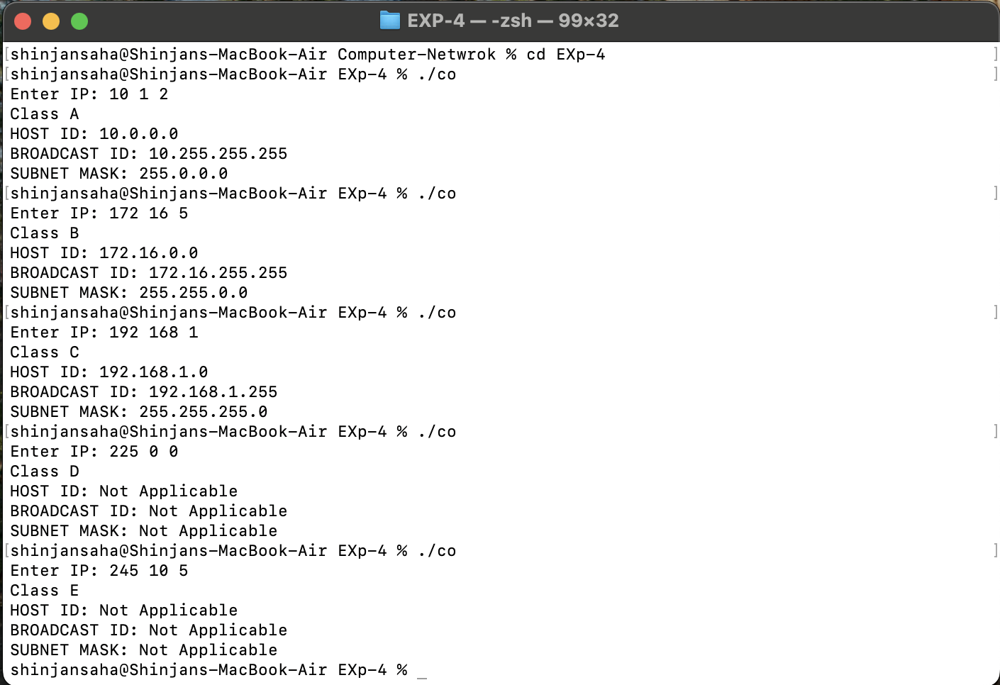

# EXP-4

## Objective:- IPV4


### Code:-

```bash
#include <stdio.h>

int main() {
    int ip[4];
    char class = ' ';
    printf("Enter IP: ");
    for (int i = 0; i < 3; i++) {
        scanf("%d", &ip[i]);
    }

    if (ip[0] >= 0 && ip[0] <= 127) {
        printf("Class A\n");
        class = 'a';
    }
    if (ip[0] >= 128 && ip[0] <= 191) {
        printf("Class B\n");
        class = 'b';
    }
    if (ip[0] >= 192 && ip[0] <= 223) {
        printf("Class C\n");
        class = 'c';
    }
    if (ip[0] >= 224 && ip[0] <= 239) {
        printf("Class D\n");
        class = 'd';
    }
    if (ip[0] >= 240 && ip[0] <= 255) {
        printf("Class E\n");
        class = 'e';
    }
    if (ip[0] > 255) {
        printf("Not valid\n");
    }

    switch (class) {
        case 'a':
            printf("HOST ID: %d.0.0.0\n", ip[0]);
            printf("BROADCAST ID: %d.255.255.255\n", ip[0]);
            printf("SUBNET MASK: 255.0.0.0\n");
            break;

        case 'b':
            printf("HOST ID: %d.%d.0.0\n", ip[0], ip[1]);
            printf("BROADCAST ID: %d.%d.255.255\n", ip[0], ip[1]);
            printf("SUBNET MASK: 255.255.0.0\n");
            break;

        case 'c':
            printf("HOST ID: %d.%d.%d.0\n", ip[0], ip[1], ip[2]);
            printf("BROADCAST ID: %d.%d.%d.255\n", ip[0], ip[1], ip[2]);
            printf("SUBNET MASK: 255.255.255.0\n");
            break;

        case 'd':
            printf("HOST ID: Not Applicable\n");
            printf("BROADCAST ID: Not Applicable\n");
            printf("SUBNET MASK: Not Applicable\n");
            break;

        case 'e':
            printf("HOST ID: Not Applicable\n");
            printf("BROADCAST ID: Not Applicable\n");
            printf("SUBNET MASK: Not Applicable\n");
            break;

        default:
            printf("Not valid");
    }
}


```

## Output:-
