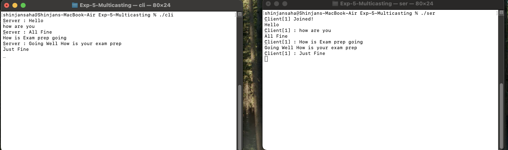

# EXP-5

## Objective:- Multicasting


### Client:-

```bash
#include <stdio.h>
#include <string.h>
#include <netinet/in.h>
#include <arpa/inet.h>
#include <sys/types.h>
#include <sys/socket.h>
#include <unistd.h>
#include <pthread.h>
#include <termios.h>
#include <stdlib.h>

void *recv_thread(void *a);
void *send_thread(void *a);
int cfd;
pthread_t sample;

int main() {
    struct sockaddr_in cl, ser;
    int n;
    pthread_t snd, rcv;

    cfd = socket(AF_INET, SOCK_STREAM, 0);

    memset(&cl, 0, sizeof(cl));
    memset(&ser, 0, sizeof(ser));

    cl.sin_family = AF_INET;
    inet_aton("10.10.104.220", &(cl.sin_addr)); // Client IP
    cl.sin_port = htons(8760);

    ser.sin_family = AF_INET;
    inet_aton(" 192.168.1.5", &(ser.sin_addr)); // Server IP
    ser.sin_port = htons(8760);

    if (connect(cfd, (struct sockaddr *)&ser, sizeof(ser)) < 0) {
        printf("Unable to establish connection!\n");
        exit(0);
    }

    pthread_create(&snd, NULL, send_thread, NULL);
    pthread_create(&rcv, NULL, recv_thread, NULL);

    pthread_join(snd, NULL);
    pthread_join(rcv, NULL);
    return 0;
}

void *send_thread(void *a) {
    char str[100];
    while (1) {
        fgets(str, 100, stdin);
        write(cfd, str, strlen(str) + 1);
        if (strcmp(str, "Bye\n") == 0) {
            close(cfd);
            exit(0);
        }
    }
}

void *recv_thread(void *a) {
    int n;
    char str[100];
    sample = pthread_self();

    while (1) {
        n = read(cfd, str, sizeof(str));
        if (n <= 0) {
            printf("Connection closed by server\n");
            close(cfd);
            exit(0);
        }
        printf("Server : %s", str);
        fflush(stdout);
    }
}

```

### Server:-

```bash
#include <stdio.h>
#include <string.h>
#include <netinet/in.h>
#include <arpa/inet.h>
#include <sys/types.h>
#include <sys/socket.h>
#include <unistd.h>
#include <pthread.h>
#include <stdlib.h>

#define MAXCLIENT 5

struct sockaddr_in ser, cli;
pthread_t sample[MAXCLIENT];
int sfd, cfd[MAXCLIENT], t = 0;
int terminate_flag = 0; // Flag to indicate termination

void *recv_thread(void *arg);
void *send_thread(void *arg);

int main() {
    socklen_t len;  
    int to socklen_t
    int num;
    pthread_t snd, rcv[MAXCLIENT];

    sfd = socket(AF_INET, SOCK_STREAM, 0);
    if (sfd < 0) {
        perror("Socket creation failed");
        exit(EXIT_FAILURE);
    }

    ser.sin_family = AF_INET;
    inet_aton(" 192.168.1.5", &(ser.sin_addr));  
    ser.sin_port = htons(8760);

    num = bind(sfd, (struct sockaddr *)&ser, sizeof(ser));
    if (num < 0) {
        perror("Bind failed");
        close(sfd);
        exit(EXIT_FAILURE);
    }

    num = listen(sfd, MAXCLIENT);
    if (num < 0) {
        perror("Listen failed");
        close(sfd);
        exit(EXIT_FAILURE);
    }

    len = sizeof(cli);
    while (t < MAXCLIENT) {
        cfd[t] = accept(sfd, (struct sockaddr *)&cli, &len);  
        if (cfd[t] < 0) {
            perror("Accept failed");
            continue;
        }

        printf("Client[%d] Joined!\n", t + 1);

        int *ptr = malloc(sizeof(int));
        *ptr = t;

        if (t == 0)
            pthread_create(&snd, NULL, send_thread, NULL);
        pthread_create(&rcv[t], NULL, recv_thread, (void *)ptr);
        t++;
    }

    pthread_join(snd, NULL);
    return 0;
}

void *send_thread(void *arg) {
    char str[100];

    while (1) {
        fgets(str, sizeof(str), stdin);

        if (strcmp(str, "Bye\n") == 0) {
            terminate_flag = 1;
            for (int pos = 0; pos < t; pos++) {
                write(cfd[pos], str, strlen(str) + 1);
            }
            break;
        } else {
            for (int pos = 0; pos < t; pos++) {
                if (terminate_flag)
                    break;
                write(cfd[pos], str, strlen(str) + 1);
            }
        }
    }
    return NULL;
}

void *recv_thread(void *arg) {
    int n;
    char str[100];
    int pos = *((int *)arg);
    sample[pos] = pthread_self();

    while (1) {
        n = read(cfd[pos], str, sizeof(str));
        if (n <= 0) {
            printf("Client[%d] Left\n", pos + 1);
            close(cfd[pos]);
            break;
        }

        if (strcmp(str, "Bye\n") == 0) {
            printf("Client[%d] Left\n", pos + 1);
            break;
        } else {
            printf("Client[%d] : %s", pos + 1, str);
            fflush(stdout);
        }
    }

    free(arg);
    return NULL;
}
```


## Output:-
