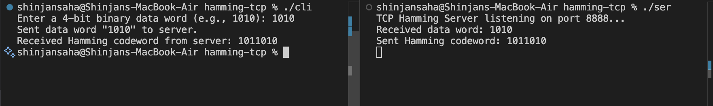

# Hamming-TCP

## Objective:- TCP client that reads a 4-bit binary data word from the user, sends it to the server, receives the Hamming(7,4) codeword, and displays it.


### Client Code:-

```bash
#include <stdio.h>
#include <stdlib.h>
#include <string.h>
#include <unistd.h>
#include <arpa/inet.h>

#define SERVER_PORT 8888
#define BUFFER_SIZE 1024

int main() {
    int sockfd;
    struct sockaddr_in server_addr;
    char data_word[BUFFER_SIZE], buffer[BUFFER_SIZE];

   
    sockfd = socket(AF_INET, SOCK_STREAM, 0);
    if (sockfd < 0) {
        perror("Client: socket creation failed");
        exit(EXIT_FAILURE);
    }

   
    server_addr.sin_family = AF_INET;
    server_addr.sin_port = htons(SERVER_PORT);
    if (inet_pton(AF_INET, "127.0.0.1", &server_addr.sin_addr) <= 0) {
        perror("Client: invalid address");
        close(sockfd);
        exit(EXIT_FAILURE);
    }

    
    if (connect(sockfd, (struct sockaddr*)&server_addr, sizeof(server_addr)) < 0) {
        perror("Client: connect failed");
        close(sockfd);
        exit(EXIT_FAILURE);
    }

    
    printf("Enter a 4-bit binary data word (e.g., 1010): ");
    if (fgets(data_word, BUFFER_SIZE, stdin) == NULL) {
        perror("Client: error reading input");
        close(sockfd);
        exit(EXIT_FAILURE);
    }

    
    data_word[strcspn(data_word, "\n")] = '\0';

   
    if (strlen(data_word) != 4) {
        fprintf(stderr, "Error: Data word must be exactly 4 bits.\n");
        close(sockfd);
        exit(EXIT_FAILURE);
    }

   
    write(sockfd, data_word, strlen(data_word));
    printf("Sent data word \"%s\" to server.\n", data_word);

   
    memset(buffer, 0, BUFFER_SIZE);
    read(sockfd, buffer, BUFFER_SIZE);
    printf("Received Hamming codeword from server: %s\n", buffer);

    close(sockfd);
    return 0;
}

```

## Server:-

```bash
#include <stdio.h>
#include <stdlib.h>
#include <string.h>
#include <unistd.h>
#include <arpa/inet.h>

#define SERVER_PORT 8888
#define BUFFER_SIZE 1024


void generate_hamming_code(const char *data, char *codeword) {
    int d[4], p[3], c[7];

    
    for (int i = 0; i < 4; i++) {
        d[i] = data[i] - '0';
    }

    
    p[0] = d[0] ^ d[1] ^ d[3]; // p1
    p[1] = d[0] ^ d[2] ^ d[3]; // p2
    p[2] = d[1] ^ d[2] ^ d[3]; // p4

    
    c[0] = p[0];
    c[1] = p[1];
    c[2] = d[0];
    c[3] = p[2];
    c[4] = d[1];
    c[5] = d[2];
    c[6] = d[3];

    for (int i = 0; i < 7; i++) {
        codeword[i] = c[i] + '0';
    }
    codeword[7] = '\0';
}

int main() {
    int sockfd, clientfd;
    struct sockaddr_in server_addr, client_addr;
    socklen_t client_len;
    char buffer[BUFFER_SIZE], codeword[BUFFER_SIZE];

   
    sockfd = socket(AF_INET, SOCK_STREAM, 0);
    if (sockfd < 0) {
        perror("Server: socket creation failed");
        exit(EXIT_FAILURE);
    }

   
    server_addr.sin_family = AF_INET;
    server_addr.sin_port = htons(SERVER_PORT);
    server_addr.sin_addr.s_addr = INADDR_ANY;

   
    if (bind(sockfd, (struct sockaddr*)&server_addr, sizeof(server_addr)) < 0) {
        perror("Server: bind failed");
        close(sockfd);
        exit(EXIT_FAILURE);
    }

    
    listen(sockfd, 5);
    printf("TCP Hamming Server listening on port %d...\n", SERVER_PORT);

    while (1) {
        client_len = sizeof(client_addr);
        clientfd = accept(sockfd, (struct sockaddr*)&client_addr, &client_len);
        if (clientfd < 0) {
            perror("Server: accept failed");
            continue;
        }

        
        memset(buffer, 0, BUFFER_SIZE);
        read(clientfd, buffer, BUFFER_SIZE);

        printf("Received data word: %s\n", buffer);

       
        generate_hamming_code(buffer, codeword);

       
        write(clientfd, codeword, strlen(codeword));
        printf("Sent Hamming codeword: %s\n", codeword);

        close(clientfd);
    }

    close(sockfd);
    return 0;
}

```


# Output

