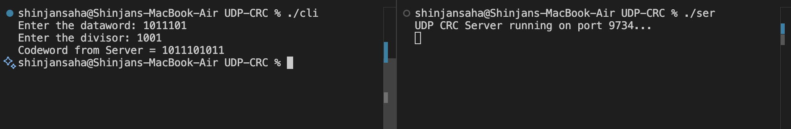

# EXP-UDP-CRC

## Objective:- UDP socket programming(Multi client using threading) – CRC


### Client Code:-

```bash
#include <stdio.h>
#include <string.h>
#include <stdlib.h>
#include <unistd.h>
#include <arpa/inet.h>

#define MAXSIZE 100

int main() {
    int sockfd;
    char dataword[MAXSIZE], divisor[MAXSIZE], buffer[MAXSIZE];
    struct sockaddr_in server_addr;

    sockfd = socket(AF_INET, SOCK_DGRAM, 0);
    if (sockfd < 0) {
        perror("Socket creation failed");
        exit(EXIT_FAILURE);
    }

    server_addr.sin_family = AF_INET;
    server_addr.sin_port = htons(9734);
    server_addr.sin_addr.s_addr = inet_addr("127.0.0.1");

   
    printf("Enter the dataword: ");
    fgets(dataword, MAXSIZE, stdin);
    sendto(sockfd, dataword, strlen(dataword), 0, (struct sockaddr*)&server_addr, sizeof(server_addr));

    
    printf("Enter the divisor: ");
    fgets(divisor, MAXSIZE, stdin);
    sendto(sockfd, divisor, strlen(divisor), 0, (struct sockaddr*)&server_addr, sizeof(server_addr));

    
    socklen_t addr_len = sizeof(server_addr);
    recvfrom(sockfd, buffer, MAXSIZE, 0, (struct sockaddr*)&server_addr, &addr_len);

    printf("Codeword from Server = %s\n", buffer);

    close(sockfd);
    return 0;
}

```

### Server Code:-

```bash
#include <stdio.h>
#include <string.h>
#include <stdlib.h>
#include <unistd.h>
#include <arpa/inet.h>

#define MAXSIZE 100

void compute_crc(char *dataword, char *divisor, char *codeword) {
    int data_len = strlen(dataword);
    int div_len = strlen(divisor);

    char temp[2 * MAXSIZE];
    strcpy(temp, dataword);

    
    for (int i = 0; i < div_len - 1; i++) {
        temp[data_len + i] = '0';
    }
    temp[data_len + div_len - 1] = '\0';

    char remainder[2 * MAXSIZE];
    strncpy(remainder, temp, div_len);
    remainder[div_len] = '\0';

    int total_len = data_len + div_len - 1;

    for (int i = div_len; i <= total_len; i++) {
       
        if (remainder[0] == '1') {
            for (int j = 0; j < div_len; j++) {
                remainder[j] = (remainder[j] == divisor[j]) ? '0' : '1';
            }
        } else {
            
            for (int j = 0; j < div_len; j++) {
                remainder[j] = (remainder[j] == '0') ? '0' : '1';
            }
        }

        
        if (i != total_len) {
            for (int j = 0; j < div_len - 1; j++) {
                remainder[j] = remainder[j + 1];
            }
            remainder[div_len - 1] = temp[i];
        }
    }

    remainder[div_len - 1] = '\0';

    // Append remainder to dataword to form codeword
    strcpy(codeword, dataword);
    strcat(codeword, remainder);
}

int main() {
    int sockfd;
    char dataword[MAXSIZE], divisor[MAXSIZE], codeword[MAXSIZE];
    struct sockaddr_in server_addr, client_addr;
    socklen_t len = sizeof(client_addr);

    sockfd = socket(AF_INET, SOCK_DGRAM, 0);
    if (sockfd < 0) {
        perror("Socket creation failed");
        exit(EXIT_FAILURE);
    }

    server_addr.sin_family = AF_INET;
    server_addr.sin_port = htons(9734);
    server_addr.sin_addr.s_addr = INADDR_ANY;

    if (bind(sockfd, (struct sockaddr*)&server_addr, sizeof(server_addr)) < 0) {
        perror("Bind failed");
        exit(EXIT_FAILURE);
    }

    printf("UDP CRC Server running on port 9734...\n");

    while (1) {
        memset(dataword, 0, MAXSIZE);
        memset(divisor, 0, MAXSIZE);
        memset(codeword, 0, MAXSIZE);

        recvfrom(sockfd, dataword, MAXSIZE, 0, (struct sockaddr*)&client_addr, &len);
        recvfrom(sockfd, divisor, MAXSIZE, 0, (struct sockaddr*)&client_addr, &len);

       
        dataword[strcspn(dataword, "\n")] = '\0';
        divisor[strcspn(divisor, "\n")] = '\0';

        compute_crc(dataword, divisor, codeword);

        sendto(sockfd, codeword, strlen(codeword), 0, (struct sockaddr*)&client_addr, len);
    }

    close(sockfd);
    return 0;
}

```


# Output

